---
## Author
author:
  name: Сахно Никита НФИбд-02-23
  degrees: DSc
  orcid: 0000-0002-0877-7063
  email: 1132230298@rudn.ru
  affiliation:
    - name: Российский университет дружбы народов
      country: Российская Федерация
      postal-code: 117198
      city: Москва
      address: ул. Миклухо-Маклая, д. 6

## Title
title: "Лабораторная работа № 1"
subtitle: "Знакомство с Cisco Packet Tracer"
license: "CC BY"
abstract: |
  В данном отчёте представлены результаты выполнения лабораторной работы по теме моделирования компьютерных сетей в Cisco Packet Tracer.

  Рассмотрены создание простейших сетевых топологий с использованием концентратора, коммутатора и маршрутизатора, настройка статических IP-адресов, передача пакетов ARP и ICMP, возникновение коллизий, а также работа протоколов STP и CDP.

  Выполнено исследование структуры передаваемых пакетов и кадров на различных уровнях модели OSI. Сделаны выводы о достижении поставленной цели.
keywords: [Cisco Packet Tracer, компьютерные сети, Hub, Switch, Router, ARP, ICMP, STP, CDP]
---

# Введение

## Актуальность

Моделирование компьютерных сетей позволяет изучать принципы взаимодействия сетевых устройств и протоколов без необходимости использования физического сетевого оборудования. Cisco Packet Tracer предоставляет возможность создавать виртуальные сетевые топологии, настраивать устройства и наблюдать за передачей сетевых пакетов.

В рамках лабораторной работы рассматриваются базовые сетевые устройства — концентратор, коммутатор и маршрутизатор. Их последовательное использование позволяет на практическом примере изучить особенности передачи данных, широковещательной рассылки, обработки MAC-адресов и возникновения коллизий.

## Цель работы

Установить инструмент моделирования конфигурации сети Cisco Packet Tracer, ознакомиться с его интерфейсом.

## Задачи

1. Установить на домашнем устройстве Cisco Packet Tracer.
2. Построить простейшую сеть в Cisco Packet Tracer и провести простейшую настройку оборудования.
3. Исследовать передачу пакетов ARP и ICMP.
4. Исследовать структуру PDU и кадров Ethernet.
5. Исследовать возникновение коллизий при использовании концентратора.
6. Сравнить передачу данных через концентратор и коммутатор.
7. Исследовать протокол STP.
8. Подключить маршрутизатор и исследовать передачу сетевых пакетов.
9. Исследовать структуру пакета CDP.

## Объект и предмет исследования

Объектом исследования является компьютерная сеть, моделируемая в среде Cisco Packet Tracer.

Предметом исследования являются принципы передачи сетевых пакетов между оконечными устройствами, а также особенности работы концентратора, коммутатора и маршрутизатора.

## Методы исследования

В работе использовались компьютерное моделирование сетевой инфраструктуры, настройка сетевых устройств, задание статических IP-адресов, визуальное наблюдение за передачей пакетов в режиме Simulation, исследование PDU, анализ структуры кадров Ethernet, исследование протоколов ARP, ICMP, STP и CDP, моделирование сетевой коллизии и сравнение поведения концентратора и коммутатора.

## Схема выполнения работы

На рис. -@fig-flowchart представлена общая последовательность действий при выполнении работы.

::: {#fig-flowchart}

```{mermaid}
%%| fig-width: 100%
graph TD
   A@{ shape: circle, label: "Начало" } --> B[Установить Cisco Packet Tracer]
   B --> C[Создать проект и сетевую топологию]
   C --> D[Настроить IP-адреса устройств]
   D --> E[Исследовать передачу ARP и ICMP]
   E --> F[Исследовать структуру PDU]
   F --> G[Смоделировать коллизию]
   G --> H[Исследовать работу коммутатора]
   H --> I[Исследовать STP]
   I --> J[Подключить маршрутизатор]
   J --> K[Исследовать CDP]
   K --> L[Сформулировать результаты и выводы]
   L --> M@{ shape: dbl-circ, label: "Конец" }
```

Схема выполнения лабораторной работы

:::

# Теоретическая часть

Cisco Packet Tracer представляет собой среду моделирования компьютерных сетей, позволяющую создавать сетевые топологии и исследовать взаимодействие между сетевыми устройствами.

В работе используются следующие основные устройства:

- концентратор (Hub) — устройство, передающее полученный кадр на остальные подключённые порты;
- коммутатор (Switch) — устройство, пересылающее кадры между портами с учётом MAC-адресов;
- маршрутизатор (Router) — устройство, обеспечивающее взаимодействие между сетями;
- оконечные устройства PC — компьютеры, участвующие в передаче и приёме данных.

ARP (Address Resolution Protocol) применяется для определения MAC-адреса устройства по известному IP-адресу.

ICMP (Internet Control Message Protocol) используется для передачи служебных сообщений сетевого уровня.

При исследовании передачи ICMP-пакета рассматривается IP-заголовок, содержащий IP-адрес источника и назначения, а также ICMP-заголовок, содержащий тип сообщения, код, контрольную сумму, идентификатор и порядковый номер.

При передаче данных по Ethernet формируется кадр, содержащий преамбулу, поле SFD, MAC-адрес назначения, MAC-адрес источника, поле Type и FCS.

STP (Spanning Tree Protocol) используется для построения связующего дерева. В составе STP-сообщения рассматриваются идентификатор протокола, версия, тип BPDU, флаги, идентификатор корневого моста, стоимость пути до корневого моста, идентификатор моста, идентификатор порта и временные параметры.

CDP (Cisco Discovery Protocol) является проприетарным протоколом Cisco второго уровня. В лабораторной работе исследуются поля версии, времени жизни, контрольной суммы и структура полей Type/Length/Value.

# Материалы и методы

Для выполнения лабораторной работы использовалась среда моделирования Cisco Packet Tracer.

В процессе работы применялись:

- оконечные устройства PC;
- концентратор Hub-PT;
- коммутатор Cisco 2950-24;
- маршрутизатор Cisco 2811;
- прямые сетевые кабели;
- кроссовый кабель;
- режим реального времени Realtime;
- режим моделирования Simulation;
- инструмент Add Simple PDU;
- вкладка OSI Model;
- окно информации о PDU.

Для сети с концентратором использовались статические IP-адреса:

```text
192.168.1.11
192.168.1.12
192.168.1.13
192.168.1.14
```

Для сети с коммутатором:

```text
192.168.1.21
192.168.1.22
192.168.1.23
192.168.1.24
```

Маска подсети для устройств:

```text
255.255.255.0
```

Для маршрутизатора использовался адрес:

```text
192.168.1.254
```

# Выполнение лабораторной работы

## Создание сети с концентратором

Был создан новый проект `lab_PT-01_nvsakhno.pkt`.

В рабочем пространстве размещены концентратор Hub-PT и четыре оконечных устройства PC. Оконечные устройства соединены с концентратором прямым кабелем.

Для оконечных устройств заданы статические IP-адреса `192.168.1.11`, `192.168.1.12`, `192.168.1.13`, `192.168.1.14` с маской подсети `255.255.255.0`.

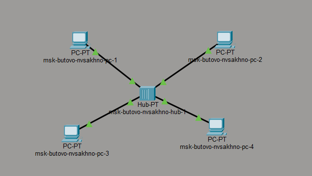{#fig-001 width=70%}

На оконечных устройствах выполнена настройка статических IP-адресов.

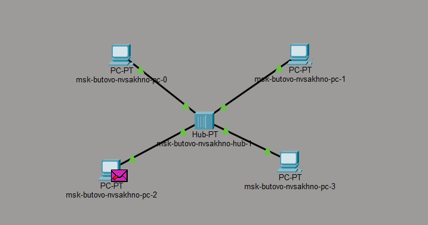{#fig-002 width=70%}

## Исследование передачи ARP и ICMP

Выполнен переход из режима Realtime в режим Simulation.

С помощью инструмента Add Simple PDU создан обмен данными между PC0 и PC2. В рабочей области появились два конверта, обозначающих пакеты. В списке событий появились события, относящиеся к пакетам ARP и ICMP.

После нажатия кнопки Play прослежено движение пакетов ARP и ICMP от PC0 к PC2 и обратно.

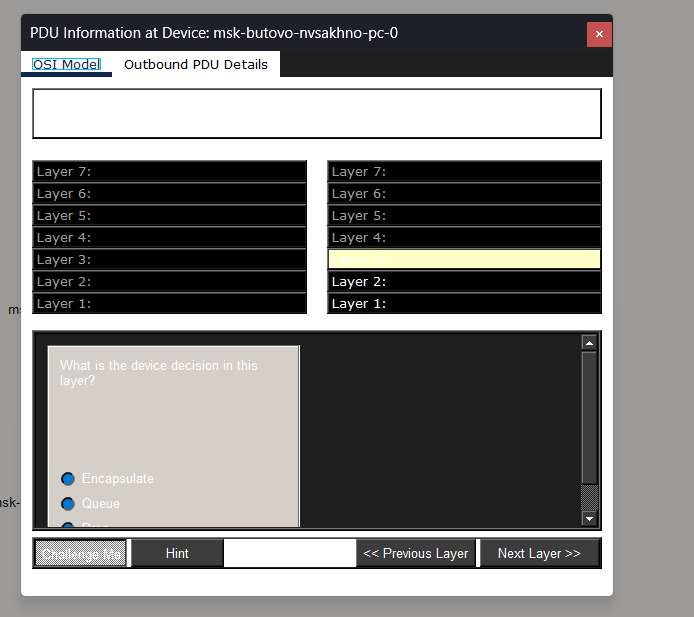{#fig-003 width=70%}

При передаче через концентратор пакет сначала отправляется на хаб, после чего рассылается по подключённым устройствам. Принимает пакет только устройство, которому он предназначен.

## Исследование PDU и модели OSI

Открыто окно информации о PDU. С помощью вкладки OSI Model исследован процесс прохождения пакета через уровни модели OSI.

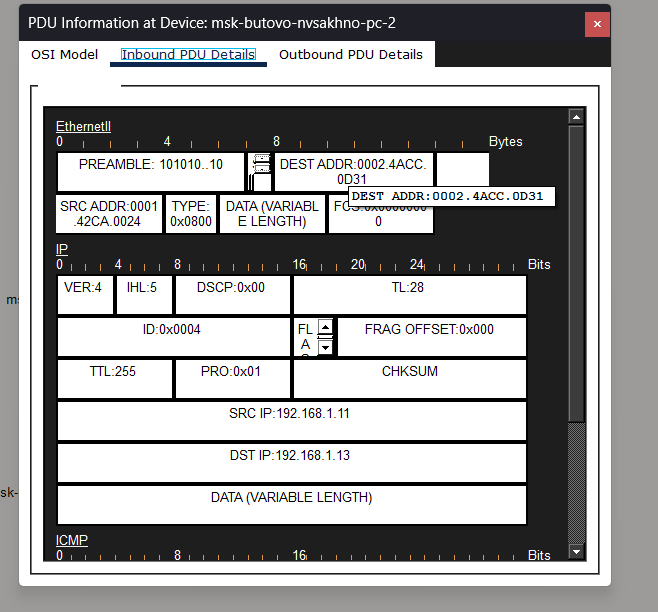{#fig-004 width=70%}

## Исследование структуры ICMP-пакета и Ethernet-кадра

В структуре ICMP-пакета присутствует IP-заголовок с IP-адресами источника и назначения, а также заголовок ICMP с типом пакета, кодом, контрольной суммой, идентификатором и порядковым номером.

Далее формируется кадр Ethernet, содержащий преамбулу, поле SFD, MAC-адрес назначения, MAC-адрес источника, поле Type и FCS.

Были рассмотрены следующие MAC-адреса:

```text
00D0.D3B9.0470 — адрес назначения PC2
00E0.8F9A.80B0 — адрес источника PC1
```

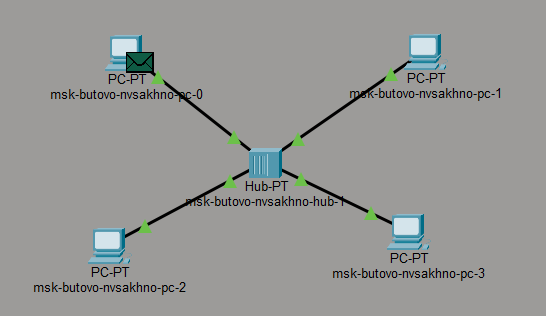{#fig-005 width=70%}

## Исследование возникновения коллизии

Список событий был очищен. После этого созданы два Simple PDU: от PC0 к PC2 и от PC2 к PC0.

После запуска моделирования исследовано возникновение коллизии.

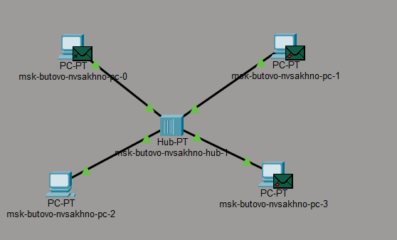{#fig-006 width=70%}

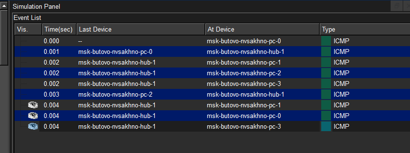{#fig-007 width=70%}

Пакеты сначала передаются на концентратор, где возникает коллизия, поскольку он не может передавать два сообщения одновременно.

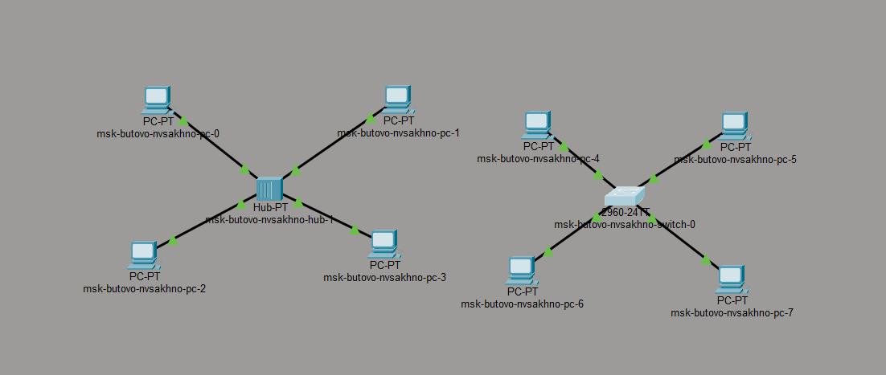{#fig-008 width=70%}

## Создание сети с коммутатором

Создана топология с использованием коммутатора Cisco 2950-24.

К коммутатору подключены четыре оконечных устройства PC. Соединение выполнено прямыми кабелями.

Для устройств заданы статические IP-адреса `192.168.1.21`, `192.168.1.22`, `192.168.1.23`, `192.168.1.24` с маской `255.255.255.0`.

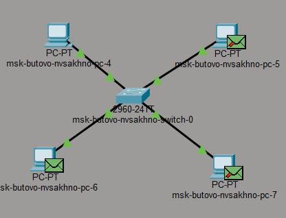{#fig-009 width=70%}

## Исследование передачи данных через коммутатор

В режиме Simulation создан Simple PDU от PC4 к PC6.

В списке событий появились пакеты ARP и ICMP. Исследована передача пакетов и структура ICMP и Ethernet.

Для передачи между PC4 и PC6 были зафиксированы MAC-адреса:

```text
000A.F311.1B6D — адрес назначения PC6
0001.420E.C255 — адрес источника PC4
```

{#fig-010 width=70%}

## Исследование отсутствия коллизии при работе коммутатора

Созданы два Simple PDU: от PC4 к PC6 и от PC6 к PC4.

После запуска моделирования коллизия не возникла. Пакеты передавались коммутатором по соответствующим направлениям.

## Исследование взаимодействия концентратора и коммутатора

Концентратор и коммутатор соединены кроссовым кабелем.

Созданы два Simple PDU: от PC0 к PC4 и от PC4 к PC0.

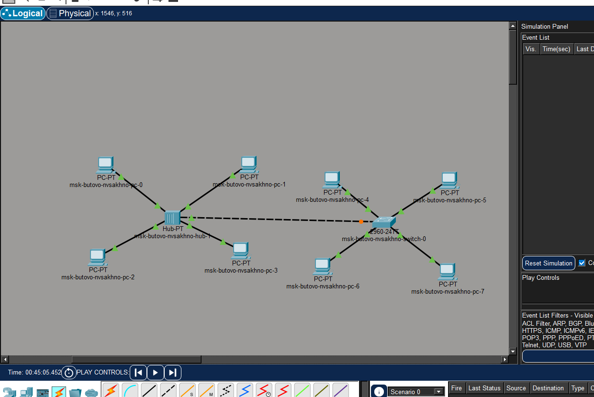{#fig-011 width=70%}

Пакет, отправленный из сети с концентратором, исчезал. Пакет, отправленный из сети с коммутатором, достигал своего назначения.

## Исследование протокола STP

После очистки списка событий и запуска моделирования обнаружены пакеты STP.

Исследованы поля заголовка STP:

- идентификатор протокола;
- версия STP;
- тип BPDU;
- CBPDU;
- флаги;
- идентификатор корневого моста;
- стоимость пути до корневого моста;
- идентификатор моста;
- идентификатор порта;
- Message Age;
- Max Age;
- Hello Time;
- Forward Delay.

В STP-пакетах кадр Ethernet имеет тип 802.3. Рассмотрены преамбула, MAC-адреса источника и назначения и поле длины.

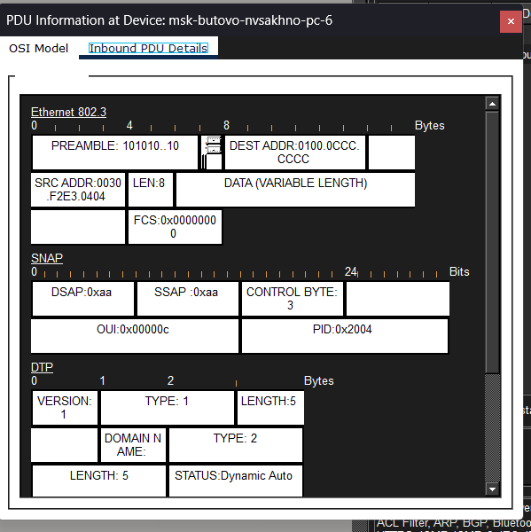{#fig-012 width=70%}

## Подключение маршрутизатора

В рабочее пространство добавлен маршрутизатор Cisco 2811.

Маршрутизатор соединён прямым кабелем с коммутатором. Для маршрутизатора задан статический IP-адрес `192.168.1.254` с маской `255.255.255.0`. Порт активирован установкой параметра Port Status в положение On.

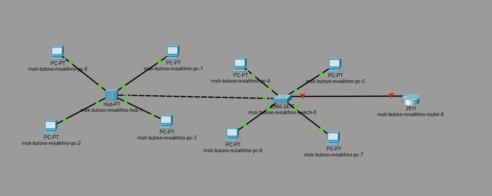{#fig-013 width=70%}

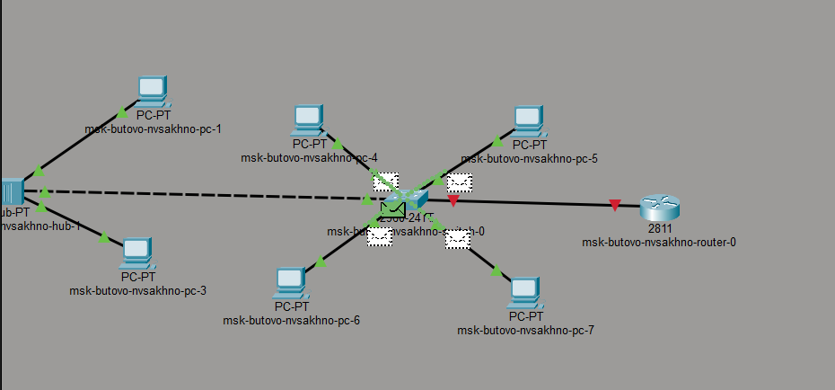{#fig-014 width=70%}

## Исследование передачи пакетов с маршрутизатором

В режиме Simulation создан Simple PDU от PC3 к маршрутизатору.

После запуска моделирования наблюдалось движение пакетов ARP, ICMP, STP и CDP.

Сначала посылаются пакеты ARP, затем ICMP. После этого наблюдались STP, DTP и CDP.

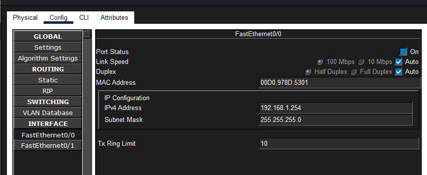{#fig-015 width=70%}

## Исследование структуры CDP-пакета

Исследована структура пакета CDP.

Рассмотрены следующие поля:

- `Version` — версия протокола CDP;
- `Time-to-Live` — время хранения информации получателем;
- `Checksum` — контрольная сумма;
- `Type` — тип поля Type/Length/Value;
- `Length` — длина полей Type/Length/Value;
- `Value` — значение, определяемое параметром Type.

Структура Ethernet-кадра CDP соответствует рассмотренному ранее кадру Ethernet 802.3.

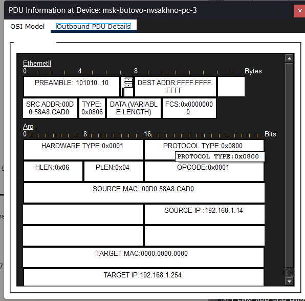{#fig-016 width=70%}

# Результаты

В результате выполнения лабораторной работы была создана модель компьютерной сети в Cisco Packet Tracer с использованием концентратора Hub-PT, коммутатора Cisco 2950-24, маршрутизатора Cisco 2811 и оконечных устройств PC.

Для сети с концентратором настроены статические IP-адреса `192.168.1.11–192.168.1.14`. Для сети с коммутатором настроены адреса `192.168.1.21–192.168.1.24`. Для маршрутизатора задан адрес `192.168.1.254`.

Исследована передача пакетов ARP и ICMP, структура PDU и Ethernet-кадра.

При одновременной передаче двух пакетов через концентратор была смоделирована коллизия.

При использовании коммутатора в рассмотренном сценарии коллизия не возникла.

Исследован протокол STP и структура соответствующих сообщений.

При подключении маршрутизатора наблюдалась передача пакетов ARP, ICMP, STP, DTP и CDP.

Исследована структура CDP-пакета и его основных полей.

# Обсуждение результатов

Полученные результаты позволяют сравнить особенности работы концентратора и коммутатора.

Концентратор передаёт полученный сигнал на подключённые устройства, поэтому при одновременной передаче данных возникает возможность коллизии. В ходе моделирования такая ситуация была наблюдена.

Коммутатор направляет кадры между портами с учётом MAC-адресов. В рассмотренном сценарии передача между PC4 и PC6 выполнялась без возникновения коллизии.

Исследование передачи ARP и ICMP позволило проследить последовательность сетевого обмена. При первоначальном взаимодействии наблюдалась передача ARP, после которой выполнялась передача ICMP.

Исследование PDU позволило рассмотреть информацию, относящуюся к различным уровням модели OSI, а также структуру IP-, ICMP- и Ethernet-заголовков.

Исследование STP показало наличие служебного обмена между сетевыми устройствами. Исследование CDP позволило рассмотреть структуру служебного пакета Cisco.

Таким образом, моделирование позволило сопоставить поведение различных сетевых устройств и наблюдать передачу сетевых пакетов в виртуальной среде.

# Заключение

В процессе выполнения лабораторной работы была достигнута поставленная цель — установлен и исследован инструмент моделирования конфигурации сети Cisco Packet Tracer.

В ходе работы:

- создана простейшая компьютерная сеть с концентратором;
- настроены статические IP-адреса;
- исследована передача ARP и ICMP;
- изучена структура PDU и прохождение пакетов по уровням модели OSI;
- исследована структура Ethernet-кадра;
- смоделировано возникновение коллизии при использовании концентратора;
- создана сеть с коммутатором Cisco 2950-24;
- исследована передача кадров через коммутатор;
- проведено сравнение поведения концентратора и коммутатора;
- исследован протокол STP;
- подключён и настроен маршрутизатор Cisco 2811;
- исследована передача пакетов ARP, ICMP, STP, DTP и CDP;
- исследована структура пакета CDP.

Полученные результаты позволили ознакомиться с интерфейсом Cisco Packet Tracer и на практике исследовать взаимодействие основных сетевых устройств и протоколов.

# Список литературы {.unnumbered}

::: {#refs}
:::

\appendix

# Что выносится в приложения {.appendix}

В данной лабораторной работе отдельные приложения не требуются, поскольку основные результаты моделирования, конфигурации устройств и исследованные пакеты представлены непосредственно в разделе «Выполнение лабораторной работы».

При необходимости в приложение могут быть вынесены дополнительные скриншоты сетевой топологии, расширенные сведения о PDU и дополнительные результаты моделирования.
