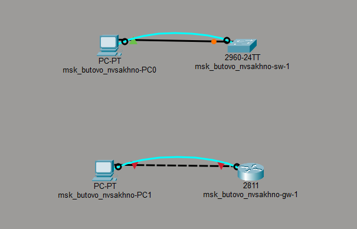
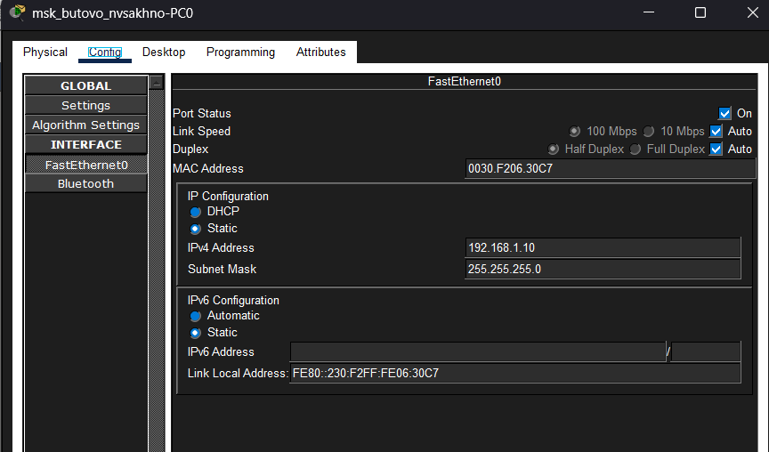
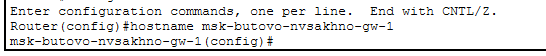
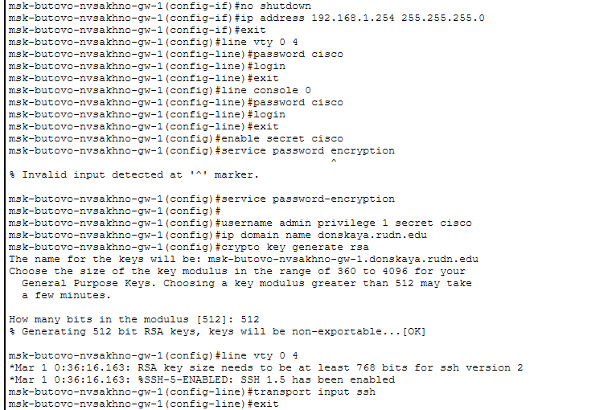

---
## Author
author:
  name: Сахно Никита НФИбд-02-23
  degrees: DSc
  orcid: 0000-0002-0877-7063
  email: 1132230298
  affiliation:
    - name: Российский университет дружбы народов
      country: Российская Федерация
      postal-code: 117198
      city: Москва
      address: ул. Миклухо-Маклая, д. 6

## Title
title: "Лабораторная работа №2"
subtitle: "Предварительная настройка оборудования Cisco"
license: "CC BY"
abstract: |
  В данном отчёте представлены результаты выполнения лабораторной работы по теме предварительной настройки оборудования Cisco.

  Описаны использованные методы, выполненные действия, полученные результаты и их анализ.

  Сделаны выводы о достижении поставленной цели.
keywords: [лабораторная работа, Cisco, сетевое оборудование, настройка, компьютерные сети]
---

# Введение

## Актуальность

Здесь обосновывается актуальность предварительной настройки оборудования Cisco, её значение при построении и администрировании компьютерных сетей.

## Цель работы

Здесь приводится формулировка цели лабораторной работы.

## Задачи

Перечисляются конкретные шаги, которые необходимо выполнить для достижения цели лабораторной работы.

## Объект и предмет исследования

Объектом исследования является сетевое оборудование Cisco.

Предметом исследования являются процессы предварительной настройки и конфигурирования сетевого оборудования.

## Методы исследования

В работе используются методы практической настройки сетевого оборудования, моделирования компьютерной сети, проверки конфигурации и анализа результатов выполненных действий.

## Схема выполнения работы

На рис. -@fig-flowchart представлена общая последовательность действий при выполнении работы.

::: {#fig-flowchart}

```{mermaid}
%%| fig-width: 100%
graph TD
   A@{ shape: circle, label: "Начало" } --> B[Подготовить оборудование]
   B --> C[Выполнить предварительную настройку]
   C --> D[Проверить конфигурацию]
   D --> E[Зафиксировать результат]
   E --> F[Описать результаты в отчёте]
   F --> G[Поместить отчёт в git-репозиторий]
   G --> H[Сделать релиз git]
   H --> I@{ shape: dbl-circ, label: "Конец" }
```

Блок-схема выполнения лабораторной работы

:::

# Теоретическая часть

В данном разделе излагаются теоретические сведения, необходимые для понимания предварительной настройки оборудования Cisco.

Рассматриваются назначение сетевого оборудования, основные параметры его конфигурации, способы подключения к устройствам и принципы выполнения базовых команд настройки.

# Материалы и методы

В этом разделе описываются используемое оборудование и программное обеспечение, параметры конфигурации, последовательность действий и методы проверки полученных результатов.

- сетевое оборудование Cisco;
- компьютер для выполнения настройки;
- программное обеспечение для работы с сетевым оборудованием;
- консольное подключение к оборудованию;
- команды предварительной настройки и проверки конфигурации.

# Выполнение лабораторной работы

В данном разделе последовательно описываются выполненные действия по предварительной настройке оборудования Cisco.

Каждый существенный этап документируется скриншотом с подписью и ссылкой на него.

## Подготовка оборудования

Описывается подготовка оборудования к выполнению лабораторной работы.

{#fig-001 width=70%}

На рис. -@fig-001 представлен результат подготовки оборудования.

## Выполнение предварительной настройки

Описываются выполненные команды и параметры предварительной настройки оборудования Cisco.

{#fig-002 width=70%}

На рис. -@fig-002 представлен результат предварительной настройки.

## Проверка конфигурации

Описываются действия, выполненные для проверки правильности настройки оборудования.

{#fig-003 width=70%}

На рис. -@fig-003 представлен результат проверки конфигурации.

## Дополнительные этапы работы

При наличии дополнительных действий они последовательно описываются в данном разделе. Для каждого этапа приводятся соответствующие скриншоты.

{#fig-004 width=70%}

На рис. -@fig-004 представлен результат выполнения соответствующего этапа.

# Результаты

В данном разделе приводятся объективные результаты, полученные в ходе выполнения лабораторной работы.

Приводятся результаты настройки оборудования, значения заданных параметров, выводы команд и скриншоты. Интерпретация результатов в данном разделе не выполняется.

# Обсуждение результатов

В данном разделе проводится анализ полученных результатов.

Рассматривается соответствие выполненной настройки поставленным требованиям, анализируются полученные параметры и возможные причины отклонений.

# Заключение

В процессе выполнения лабораторной работы была выполнена предварительная настройка оборудования Cisco.

Основные итоги работы:

- выполнена подготовка сетевого оборудования;
- выполнена предварительная настройка оборудования;
- проверена корректность конфигурации;
- зафиксированы результаты выполненных действий;
- достигнута поставленная цель лабораторной работы.

# Список литературы {.unnumbered}

::: {#refs}
:::

\appendix

# Что выносится в приложения {.appendix}

При необходимости сюда выносятся:

- листинги программ и команд;
- большие таблицы с исходными данными;
- промежуточные результаты настройки;
- дополнительные скриншоты;
- дополнительные материалы по выполненной лабораторной работе.

Каждое приложение начинается с новой страницы и имеет заголовок.
