---
## Author
author:
  name: Сахно Никита НФИбд-02-23
  degrees: DSc
  orcid: 0000-0002-0877-7063
  email: 1132230298
  affiliation:
    - name: Российский университет дружбы народов
      country: Российская Федерация
      postal-code: 117198
      city: Москва
      address: ул. Миклухо-Маклая, д. 6

## Title
title: "Лабораторная работа № 5"
subtitle: "Конфигурирование VLAN"
license: "CC BY"
abstract: |
  В данном отчёте представлены результаты выполнения лабораторной работы по настройке VLAN
  на коммутаторах сети.

  Рассмотрены настройка Trunk-портов, конфигурация VTP-сервера и VTP-клиентов,
  назначение портов в соответствующие VLAN, настройка IP-адресов и проверка связности
  устройств внутри одного VLAN и между различными VLAN.

  Сделаны выводы по результатам выполнения лабораторной работы.
keywords: [VLAN, VTP, Trunk, Cisco Packet Tracer, ICMP, ARP, MAC-адрес]
---

# Введение

## Актуальность

VLAN позволяют логически разделять устройства локальной сети на отдельные виртуальные сегменты. Настройка Trunk-портов и использование VTP обеспечивают передачу и централизованное распространение информации о VLAN между коммутаторами. Проверка связности устройств позволяет убедиться в корректности выполненной конфигурации.

## Цель работы

Получить основные навыки по настройке VLAN на коммутаторах сети.

## Задачи

1. На коммутаторах сети настроить Trunk-порты на соответствующих интерфейсах, связывающих коммутаторы между собой.
2. Коммутатор msk-donskaya-sw-1 настроить как VTP-сервер и прописать на нём номера и названия VLAN.
3. Коммутаторы msk-donskaya-sw-2 — msk-donskaya-sw-4, msk-pavlovskaya-sw-1 настроить как VTP-клиенты, на интерфейсах указать принадлежность к соответствующему VLAN.
4. На серверах прописать IP-адреса.
5. На оконечных устройствах указать соответствующий адрес шлюза и прописать статические IP-адреса из диапазона соответствующей сети, следуя регламенту выделения IP-адресов.
6. Проверить доступность устройств, принадлежащих одному VLAN, и недоступность устройств, принадлежащих разным VLAN.
7. При выполнении работы необходимо учитывать соглашение об именовании.

## Объект и предмет исследования

**Объект исследования** — локальная сеть, построенная на коммутаторах Cisco.

**Предмет исследования** — настройка виртуальных локальных сетей VLAN, Trunk-портов,
протокола VTP и параметров IP-адресации в Cisco Packet Tracer.

## Методы исследования

В работе использовались практическая настройка сетевого оборудования в Cisco Packet Tracer,
анализ конфигурации коммутаторов с помощью команд Cisco IOS, проверка IP-связности с помощью
`ping`, просмотр параметров интерфейсов и IP-адресов с помощью `ipconfig`, а также исследование
передачи ICMP-пакетов в режиме симуляции.

## Схема выполнения работы

На рис. -@fig-flowchart представлена общая последовательность действий при выполнении работы.

```{mermaid}
flowchart TD
    A[Открытие файла .pkt] --> B[Настройка Trunk-портов]
    B --> C[Создание VLAN]
    C --> D[Настройка VTP-сервера]
    D --> E[Настройка VTP-клиентов]
    E --> F[Назначение портов в VLAN]
    F --> G[Настройка IP-адресов]
    G --> H[Проверка ping]
    H --> I[Исследование ICMP в режиме симуляции]
```

::: {#fig-flowchart}
Общая схема выполнения лабораторной работы.
:::

# Теоретическая часть

VLAN (Virtual Local Area Network) используются для логического разделения локальной сети.
Устройства, принадлежащие одному VLAN, образуют отдельный широковещательный домен.

Trunk-порт предназначен для передачи трафика нескольких VLAN между сетевыми устройствами.
VTP (VLAN Trunking Protocol) используется для обмена информацией о VLAN между коммутаторами
в домене VTP. В рамках работы один коммутатор настраивается как VTP-сервер, а остальные —
как VTP-клиенты.

Для проверки связности используются ICMP-сообщения, передаваемые, в частности, при выполнении
команды `ping`. Протокол ARP используется для определения MAC-адреса по известному IP-адресу
в локальной сети. MAC-адрес идентифицирует сетевой интерфейс устройства на канальном уровне.

# Материалы и методы

Для выполнения работы использовался ранее созданный файл Cisco Packet Tracer с размещёнными
и подключёнными сетевыми устройствами. В работе применялись коммутаторы Cisco, маршрутизатор
и оконечные устройства.

Основные этапы настройки:

- конфигурация Trunk-портов;
- создание VLAN и назначение им номеров и названий;
- настройка VTP-сервера;
- настройка VTP-клиентов;
- назначение интерфейсов в соответствующие VLAN;
- настройка статических IP-адресов;
- проверка доступности устройств;
- исследование ICMP-пакетов в режиме симуляции.

# Выполнение лабораторной работы

Откроем файл `.pkt`, сделанный в предыдущей лабораторной работе, где уже размещены и подключены устройства, и начнём выполнять конфигурацию VLAN.

# Выполнение лабораторной работы

Откроем файл .pkt, сделанный в предыдущей лабораторной работе, где у нас уже размещены и подключены устройства, и начнем выполнять конфигурацию VLAN.

Используя приведённую в файле лабораторной работы последовательность команд из примера по конфигурации Trunk-порта на интерфейсе g0/1 коммутатора msk-donskaya-sw-1, настроем Trunk-порты на соответствующих интерфейсах всех коммутаторов.(рис. [-@fig:001]).

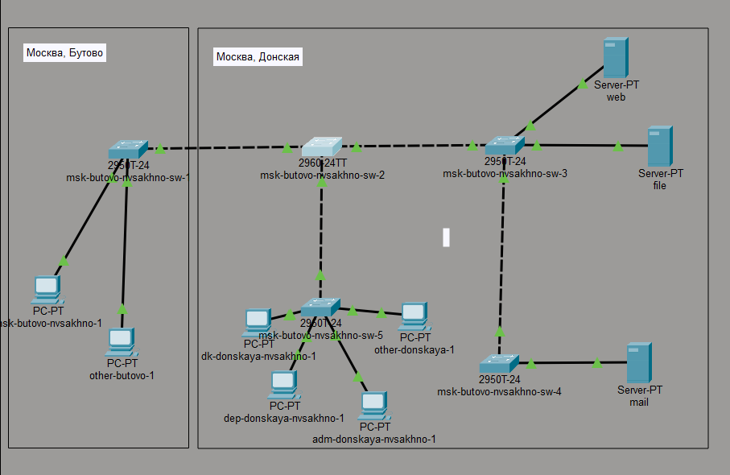{#fig-001 width=70%}

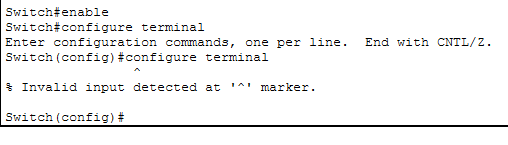{#fig-002 width=70%}

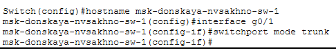{#fig-003 width=70%}

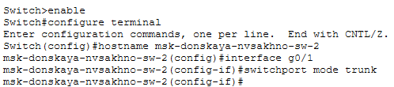{#fig-004 width=70%}

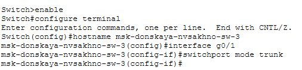{#fig-005 width=70%}

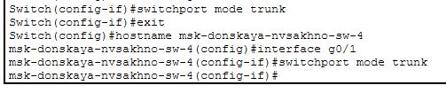{#fig-006 width=70%}

Используя приведённую в лабораторной работе последовательность команд по конфигурации VTP, настроем коммутатор msk-donskaya-sw-1 как VTP-сервер и пропишем на нём номера и названия VLAN. Настроем коммутаторы msk-donskaya-sw-2 — msk-donskaya-sw-4, msk-pavlovskaya-sw-1 как VTP-клиенты.

Сначала зададим список VLAN:

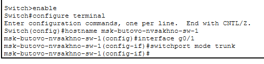{#fig-007 width=70%}

Убедимся, что VLAN заданы, выполнив команду `show vlan`:

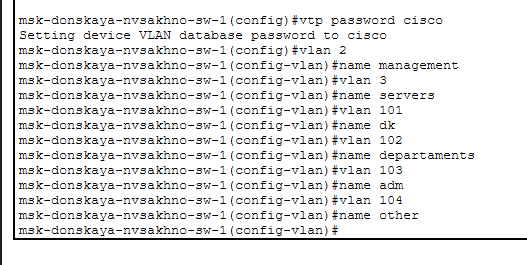{#fig-008 width=70%}

Теперь настроем msk-donskaya-nvsakhno-sw-1 как VTP-сервер:

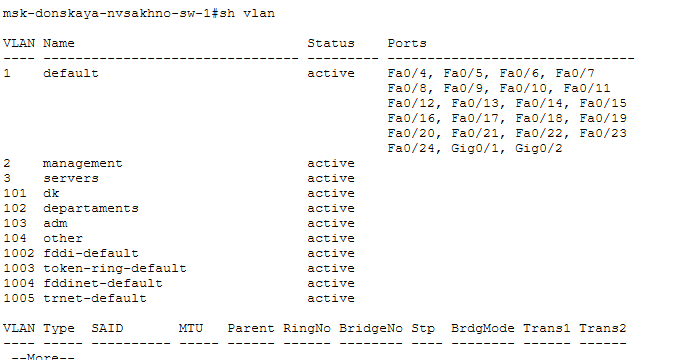{#fig-009 width=70%}

Благодаря протоколу VTP мы можем задать VLAN только на сервере, тогда на клиентах будут отражаться такие же VLAN.

Настроем msk-donskaya-nvsakhno-sw-2 как VTP-клиент:

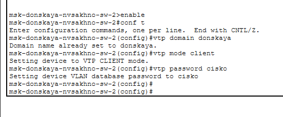{#fig-010 width=70%}

Настроем msk-donskaya-nvsakhno-sw-3 как VTP-клиент:

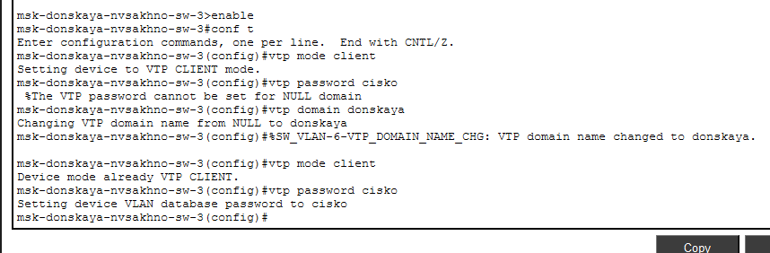{#fig-011 width=70%}

Настроем msk-donskaya-nvsakhno-sw-4 как VTP-клиент:

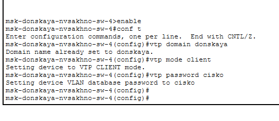{#fig-012 width=70%}

Посмотрим vtp статус, увидим, что у нас подключено 11 VLAN, и устройство является клиентом:

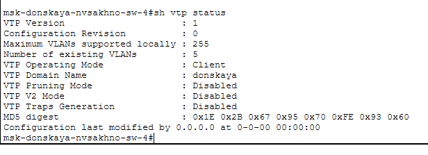{#fig-013 width=70%}

Проверим, что у нас отображаются нужные VLAN:

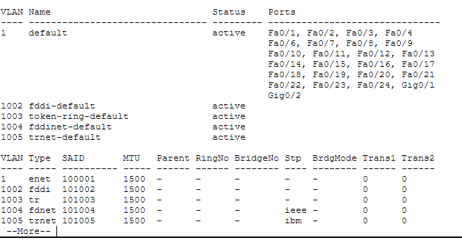{#fig-014 width=70%}

Настроем msk-pavlovskaya-nvsakhno-sw-1 как VTP-клиент:

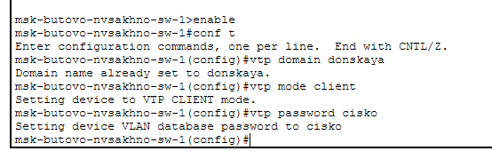{#fig-015 width=70%}

Используя приведённую в лабораторной работе последовательность команд по конфигурации диапазонов портов и на интерфейсах
укажем принадлежность к VLAN.

Выполним эту конфигурацию в соответствии с таблицей:

:Таблица портов

| Устройство                       | Порт        | Примечание           | Access VLAN | Trunk VLAN               |
|----------------------------------|-------------|----------------------|-------------|--------------------------|
| msk-donskaya-nvsakhno-gw-1    | f0/1        | UpLink               |             |                          |
|                                  | f0/0        | msk-donskaya-sw-1    |             | 2, 3, 101, 102, 103, 104 |
| msk-donskaya-nvsakhno-sw-1    | f0/24       | msk-donskaya-gw-1    |             | 2, 3, 101, 102, 103, 104 |
|                                  | g0/1        | msk-donskaya-sw-2    |             | 2, 3                     |
|                                  | g0/2        | msk-donskaya-sw-4    |             | 2, 101, 102, 103, 104    |
|                                  | g0/1        | msk-pavlovskaya-sw-1 |             | 2, 101, 104              |
| msk-donskaya-nvsakhno-sw-2    | g0/1        | msk-donskaya-sw-1    |             | 2, 3                     |
|                                  | g0/2        | msk-donskaya-sw-3    |             | 2, 3                     |
|                                  | f0/1        | Web-server           | 3           |                          |
|                                  | f0/2        | File-server          | 3           |                          |
| msk-donskaya-nvsakhno-sw-3    | g0/1        | msk-donskaya-sw-2    |             | 2, 3                     |
|                                  | f0/1        | Mail-server          | 3           |                          |
|                                  | f0/2        | Dns-server           | 3           |                          |
| msk-donskaya-nvsakhno-sw-4    | g0/1        | msk-donskaya-sw-1    |             | 2, 101, 102, 103, 104    |
|                                  | f0/1–f0/5   | dk                   | 101         |                          |
|                                  | f0/6–f0/10  | departments          | 102         |                          |
|                                  | f0/11–f0/15 | adm                  | 103         |                          |
|                                  | f0/16–f0/24 | other                | 104         |                          |
| msk-pavlovskaya-nvsakhno-sw-1 | f0/24       | msk-donskaya-sw-1    |             | 2, 101, 104              |
|                                  | f0/1–f0/15  | dk                   | 101         |                          |
|                                  | f0/20       | other                | 104         |                          | 

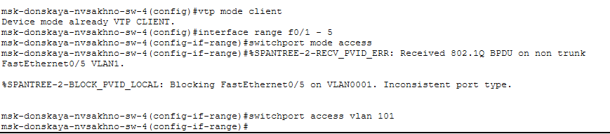{#fig-016 width=70%}

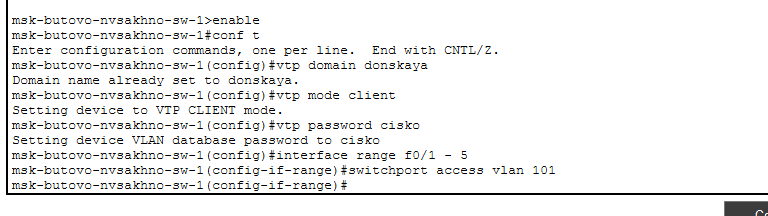{#fig-017 width=70%}

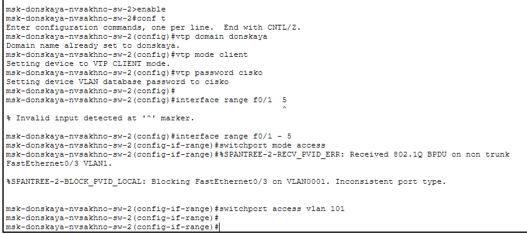{#fig-018 width=70%}

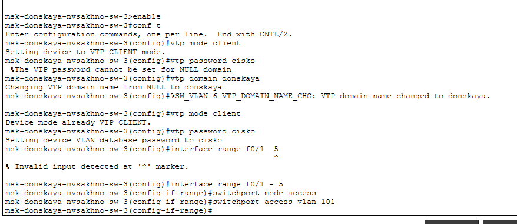{#fig-019 width=70%}

Укажем статические IP-адреса на оконечных устройствах и проверим с помощью команды ping доступность устройств, принадлежащих
одному VLAN, и недоступность устройств, принадлежащих разным VLAN.

Задавать IP-адреса будем в соответствии с таблицей:

:Таблица IP. Сеть 10.128.0.0/16

| IP-адреса               | Примечание                 | VLAN |
|-------------------------|----------------------------|------|
| 10.128.0.0/16           | Вся сеть                   |      |
| 10.128.0.0/24           | Серверная ферма            | 3    |
| 10.128.0.1              | Шлюз                       |      |
| 10.128.0.2              | Web                        |      |
| 10.128.0.3              | File                       |      |
| 10.128.0.4              | Mail                       |      |
| 10.128.0.5              | Dns                        |      |
| 10.128.0.6-10.128.0.254 | Зарезервировано            |      |
| 10.128.1.0/24           | Управление                 | 2    |
| 10.128.1.1              | Шлюз                       |      |
| 10.128.1.2              | msk-donskaya-sw-1          |      |
| 10.128.1.3              | msk-donskaya-sw-2          |      |
| 10.128.1.4              | msk-donskaya-sw-3          |      |
| 10.128.1.5              | Msk-donskaya-sw-4          |      |
| 10.128.1.6              | msk-pavlovskaya-sw-1       |      |
| 10.128.1.7-10.128.1.254 | Зарезервировано            |      |
| 10.128.2.0/24           | Сеть Point-to-Point        |      |
| 10.128.2.1              | Шлюз                       |      |
| 10.128.2.2-10.128.2.254 | Зарезервировано            |      |
| 10.128.3.0/24           | Дисплейные классы(DK)      | 101  |
| 10.128.3.1              | Шлюз                       |      |
| 10.128.3.2-10.128.3.254 | Пул для пользователей      |      |
| 10.128.4.0/24           | Кафедра (DEP)              | 102  |
| 10.128.4.1              | Шлюз                       |      |
| 10.128.4.2-10.128.4.254 | Пул для пользователей      |      |
| 10.128.5.0/24           | Администрация (ADM)        | 103  |
| 10.128.5.1              | Шлюз                       |      |
| 10.128.5.2-10.128.5.254 | Пул для пользователей      |      |
| 10.128.6.0/24           | Другие пользователи(OTHER) | 104  |
| 10.128.6.1              | Шлюз                       |      |
| 10.128.6.2-10.128.6.254 | Пул для пользователей      |      |

Задаем IP-адрес шлюзу и самому серверу web:

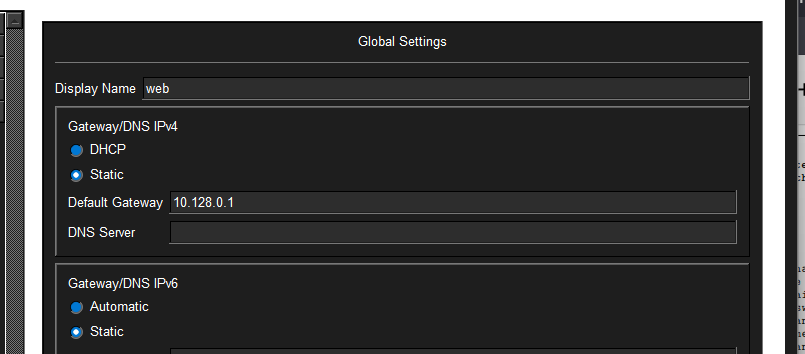{#fig-020 width=70%}

{#fig-021 width=70%}

По аналогии и с помощью таблицы IP-адресов задаем IP-адреса всем оконечным устройствам.

Далее выполним проверку нашей настройке устройств и пропингуем dk-pavlovskaya-nvsakhno-1 с dk-donskaya-nvsakhno-1.

Выполнив команду `ipconfig` можем посмотреть заданные IP-адреса:

{#fig-022 width=70%}

Выполним команду `ping`. Так как эти устройства находятся в одной сети, то пингование проходит успешно.
Но если мы попробуем с dk-donskaya-nvsakhno-1 пропинговать dk-pavlovskaya-nvsakhno-1, который находиться в другом VLAN, у нас ничего не получится.

{#fig-023 width=70%}

Используя режим симуляции в Packet Tracer, изучим процесс передвижения пакета ICMP по сети. Изучим содержимое передаваемого пакета и заголовки задействованных протоколов.

Передача пакета между устройствами из одной сети проходит успешно.

{#fig-024 width=70%}

Можем посмотреть информацию о пакете, его заголовки. Кадр физического уровня Ethernet, где указаны mac-адреса, кадр сетевого уровня IP, где указаны IP-адреса и ICMP кадр.

{#fig-025 width=70%}

При передачи пакетов между устройствами из разных сетей происходит сбой:

{#fig-026 width=70%}

# Результаты

В результате выполнения работы были настроены Trunk-порты на соответствующих интерфейсах
коммутаторов, создан список VLAN, настроен VTP-сервер и подключены VTP-клиенты. Порты
оконечных устройств были распределены по соответствующим VLAN согласно заданной таблице.

Для устройств была выполнена IP-адресация в соответствии с сетью `10.128.0.0/16`.
Проверка с помощью `ping` показала успешную передачу пакетов между устройствами, находящимися
в одном VLAN, и отсутствие связности между устройствами из разных VLAN.

В режиме симуляции был рассмотрен процесс передачи ICMP-пакета и содержимое PDU, включая
кадры Ethernet, IP и ICMP.

# Обсуждение результатов

Полученные результаты соответствуют поставленным задачам. Trunk-порты обеспечили передачу
трафика нескольких VLAN между коммутаторами, а VTP позволил распространить созданные VLAN
с сервера на клиентские коммутаторы. Назначение портов в VLAN и настройка IP-адресов позволили
проверить различия в доступности устройств, относящихся к одному и разным VLAN.

При анализе PDU в режиме симуляции были рассмотрены MAC-адреса канального уровня,
IP-адреса сетевого уровня и ICMP-сообщения.

# Заключение

{conclusion_text}

# Контрольные вопросы

{questions}

# Список литературы {{.unnumbered}}

:::
:::

\appendix

# Что выносится в приложения {{.appendix}}

В приложения могут быть вынесены дополнительные скриншоты конфигурации сетевых устройств,
полные таблицы адресации и дополнительные результаты проверки связности.
