---
## Front matter
title: "Лабораторная работа № 8"
subtitle: "Настройка сетевых сервисов DHCP"
author: "Сахно Никита Вячеславович"

## Generic otions
lang: ru-RU
toc-title: "Содержание"

## Pdf output format
toc: true # Table of contents
toc-depth: 2
lof: true # List of figures
lot: true # List of tables
fontsize: 12pt
linestretch: 1.5
papersize: a4
documentclass: scrreprt
## I18n polyglossia
polyglossia-lang:
  name: russian
  options:
  - spelling=modern
  - babelshorthands=true
polyglossia-otherlangs:
  name: english
## I18n babel
babel-lang: russian
babel-otherlangs: english
## Fonts
mainfont: PT Serif
romanfont: PT Serif
sansfont: PT Sans
monofont: PT Mono
mainfontoptions: Ligatures=TeX
romanfontoptions: Ligatures=TeX
sansfontoptions: Ligatures=TeX,Scale=MatchLowercase
monofontoptions: Scale=MatchLowercase,Scale=0.9
## Biblatex
biblatex: true
biblio-style: "gost-numeric"
biblatexoptions:
  - parentracker=true
  - backend=biber
  - hyperref=auto
  - language=auto
  - autolang=other*
  - citestyle=gost-numeric
## Pandoc-crossref LaTeX customization
figureTitle: "Рис."
tableTitle: "Таблица"
listingTitle: "Листинг"
lofTitle: "Список иллюстраций"
lotTitle: "Список таблиц"
lolTitle: "Листинги"
## Misc options
indent: true
header-includes:
  - \usepackage{indentfirst}
  - \usepackage{float} # keep figures where there are in the text
  - \floatplacement{figure}{H} # keep figures where there are in the text
---

# Цель работы

Приобретение практических навыков по настройке динамического распределения IP-адресов посредством протокола DHCP (Dynamic Host Configuration
Protocol) в локальной сети.

# Задание

1. Добавить DNS-записи для домена donskaya.rudn.ru на сервер dns.
2. Настроить DHCP-сервис на маршрутизаторе.
3. Заменить в конфигурации оконечных устройствах статическое распределение адресов на динамическое.
4. При выполнении работы необходимо учитывать соглашение об именовании

# Выполнение лабораторной работы
В логическую рабочую область проекта добавим сервер dns и подключим его
к коммутатору msk-donskaya-nvsakhno-sw-3 через порт Fa0/2, не забыв активировать порт при помощи соответствующих команд на коммутаторе (рис. [-@fig:001]).

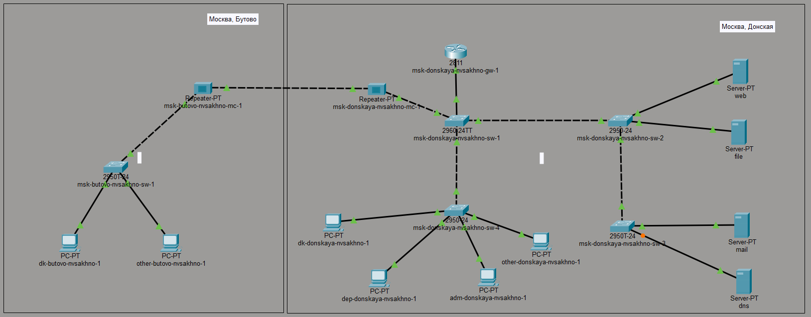{#fig:001 width=70%}

Активируем порты. (рис. [-@fig:002]).

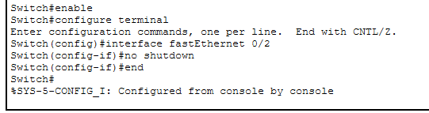{#fig:001 width=70%}

В конфигурации сервера укажем в качестве адреса шлюза 10.128.0.1 (рис.
3.3), а в качестве адреса самого сервера — 10.128.0.5 с соответствующей маской
255.255.255.0 (рис. [-@fig:003]).

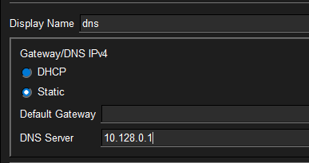{#fig:001 width=70%}

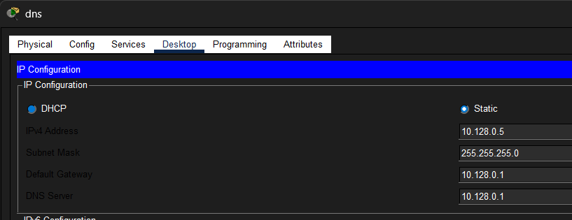{#fig:001 width=70%}

Настроем сервис DNS: (рис. [-@fig:005]).
• в конфигурации сервера выберем службу DNS, активируем её (выбрав флаг
On);
• в поле Type в качестве типа записи DNS выберем записи типа A(A Record);
• в поле Name укажем доменное имя, по которому можно обратиться, например, к web-серверу — www.donskaya.rudn.ru, затем укажем его IP-адрес в
соответствующем поле 10.128.0.2;
• нажав на кнопку Add , добавьте DNS-запись на сервер;
• аналогичным образом добавим DNS-записи для серверов mail, file, dns согласно распределению адресов из таблицы, сделанной в лабораторной работе №3
• сохраним конфигурацию сервера

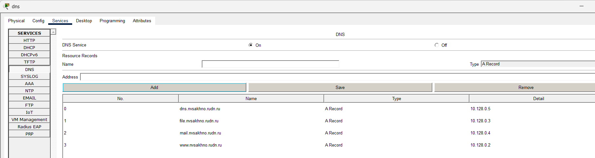{#fig:001 width=70%}

Настроем DHCP-сервис на маршрутизаторе, используя приведённые в лабораторной работе №8 команды для каждой выделенной сети (рис. [-@fig:006]).:
• укажем IP-адрес DNS-сервера;
• перейдем к настройке DHCP;
• зададим название конфигурируемому диапазону адресов (пулу адресов),
укажем адрес сети, а также адреса шлюза и DNS-сервера;
• зададим пулы адресов, исключаемых из динамического распределения

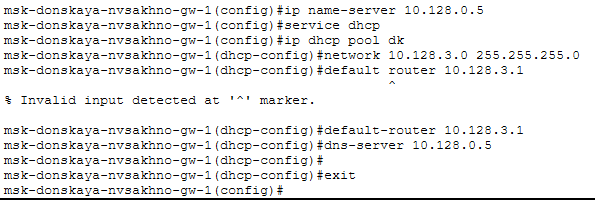{#fig:001 width=70%}

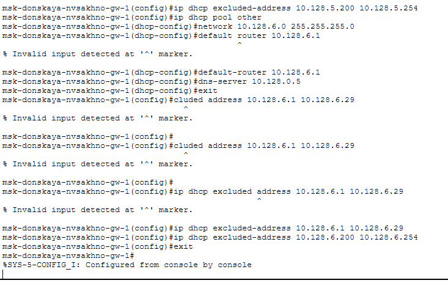{#fig:001 width=70%}

Посмотрим информацию о настроенных пулах DHCP (рис. [-@fig:008]).

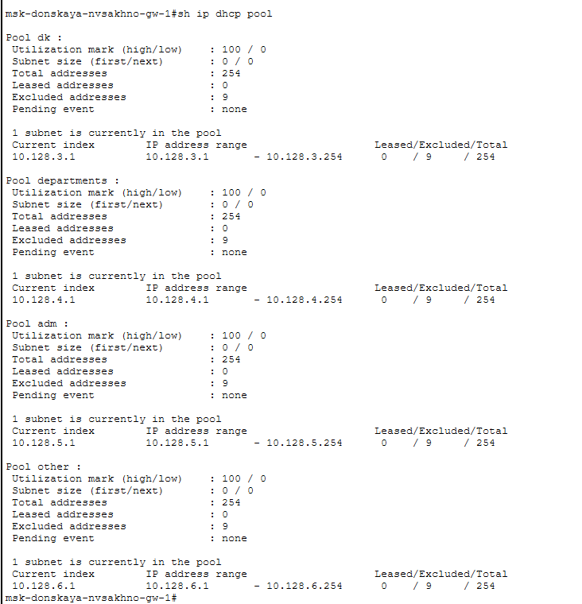{#fig:001 width=70%}

Также посмотрим информацию о привязках выданных адресов, но
пока нет выданных адресов (рис. [-@fig:009]).

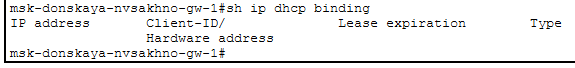{#fig:001 width=70%}

Изначально у нас были заданы статические ip-адреса, можем посмотреть их
с помощью команды ipconfig (рис. [-@fig:010]).

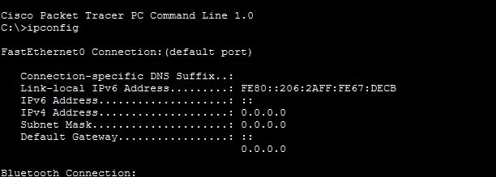{#fig:001 width=70%}

Теперь на оконечных устройствах заменим в настройках статическое распределение адресов на динамическое (рис. [-@fig:011]).

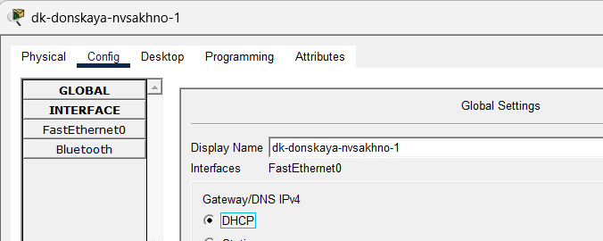{#fig:001 width=70%}

Проверим, какой ip-адрес выделен теперь (рис. [-@fig:012]).

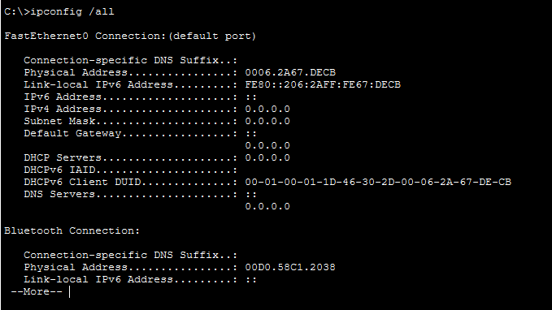{#fig:001 width=70%}

В режиме симуляции изучим, каким образом происходит запрос адреса по
протоколу DHCP (рис. [-@fig:013]).

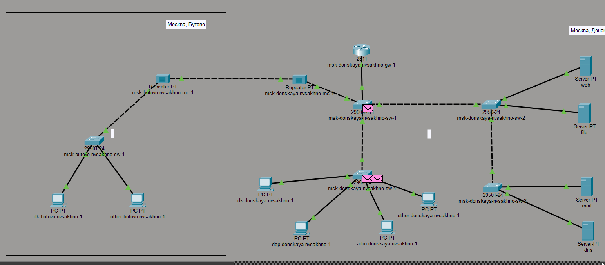{#fig:001 width=70%}

# Выводы
В ходе выполнения лабораторной работы я приобретел практические навыки по настройке динамического распределения IP-адресов посредством протокола DHCP (Dynamic Host Configuration
Protocol) в локальной сети.

# Контрольные вопросы

1. За что отвечает протокол DHCP?
Позволяет серверу динамически распределять
IP-адреса и сведения о конфигурации клиентам.

2. Какие типы DHCP-сообщений передаются по сети?
По данным источника, в DHCP-протоколе используются следующие типы сообщений:
• DHCPDISCOVER — клиент отправляет пакет, пытаясь найти сервер DHCP в
сети.
• DHCPOFFER — сервер отправляет пакет, включающий предложение
использовать уникальный IP-адрес.
• DHCPREQUEST — клиент отправляет пакет с просьбой выдать в аренду
предложенный уникальный адрес.
• DHCPACK — сервер отправляет пакет, в котором утверждается запрос клиента на использование IP-адреса.

3. Какие параметры могут быть переданы в сообщениях DHCP?
Параметры DHCP могут включать IP-адреса, шлюзы, DNS-серверы, временные интервалы аренды и другие настройки сети

4. Что такое DNS?
DNS (Система доменных имён, англ. Domain Name System) — это иерархическая децентрализованная система именования для интернет-ресурсов подключённых к Интернет, которая ведёт список доменных имён вместе с их числовыми IP-адресами или местонахождениями. DNS позволяет перевести простое
запоминаемое имя хоста в IP-адрес.

5. Какие типы записи описания ресурсов есть в DNS и для чего они используются?
Основными ресурсными записями DNS являются:
• A-запись — одна из самых важных записей. Именно эта запись указывает
на IP-адрес сервера, который привязан к доменному имени.
• MX-запись — указывает на сервер, который будет использован при отсылке доменной электронной почты.
• NS-запись — указывает на DNS-сервер домена.
• CNAME-запись — позволяет одному из поддоменов дублировать DNSзаписи своего родителя.