---
## Author
author:
  name: Сахно Никита НФИбд-02-23
  degrees: DSc
  orcid: 0000-0002-0877-7063
  email: 1132230298
  affiliation:
    - name: Российский университет дружбы народов
      country: Российская Федерация
      postal-code: 117198
      city: Москва
      address: ул. Миклухо-Маклая, д. 6

## Title
title: "Лабораторная работа № 8"
subtitle: "Настройка сетевых сервисов DHCP"
license: "CC BY"
abstract: |
  В данном отчёте представлены результаты выполнения лабораторной работы по настройке
  сетевых сервисов DHCP и DNS в локальной сети.

  Рассмотрены добавление DNS-записей, настройка DHCP-сервиса на маршрутизаторе,
  переход оконечных устройств со статической IP-адресации на динамическую
  и исследование процесса получения адреса по протоколу DHCP.

  Сделаны выводы по результатам выполненной настройки.
keywords: [DHCP, DNS, IP-адресация, Cisco Packet Tracer, сетевые сервисы]
---

# Введение

## Актуальность

Динамическое распределение IP-адресов позволяет автоматизировать настройку параметров
сетевых устройств и уменьшить объём ручной конфигурации. Протокол DHCP предоставляет
клиентам необходимые параметры сетевой конфигурации, а DNS обеспечивает сопоставление
доменного имени с IP-адресом.

## Цель работы

Приобретение практических навыков по настройке динамического распределения IP-адресов
посредством протокола DHCP (Dynamic Host Configuration Protocol) в локальной сети.

## Задачи

1. Добавить DNS-записи для домена `donskaya.rudn.ru` на сервер DNS.
2. Настроить DHCP-сервис на маршрутизаторе.
3. Заменить на оконечных устройствах статическое распределение адресов на динамическое.
4. При выполнении работы учитывать соглашение об именовании.

## Объект и предмет исследования

**Объект исследования** — локальная сеть, построенная в Cisco Packet Tracer.

**Предмет исследования** — настройка сетевых сервисов DNS и DHCP, а также динамическое
распределение IP-адресов оконечным устройствам.

## Методы исследования

В работе использовались практическая настройка сетевых устройств в Cisco Packet Tracer,
конфигурирование DNS-записей и DHCP-пулов, просмотр параметров IP-адресации с помощью
`ipconfig`, а также исследование обмена DHCP-сообщениями в режиме симуляции.

## Схема выполнения работы

На рис. -@fig-flowchart представлена общая последовательность действий при выполнении работы.

```{mermaid}
flowchart TD
    A[Добавление DNS-сервера] --> B[Активация портов]
    B --> C[Настройка IP DNS-сервера]
    C --> D[Создание DNS-записей]
    D --> E[Настройка DHCP на маршрутизаторе]
    E --> F[Проверка DHCP-пулов]
    F --> G[Переход клиентов на DHCP]
    G --> H[Проверка полученных IP-адресов]
    H --> I[Исследование DHCP в режиме симуляции]
```

::: {#fig-flowchart}
Общая схема выполнения лабораторной работы.
:::

# Теоретическая часть

DHCP (Dynamic Host Configuration Protocol) используется для динамического распределения
IP-адресов и параметров сетевой конфигурации клиентским устройствам.

В процессе получения адреса DHCP-клиент может использовать сообщения DHCPDISCOVER,
DHCPOFFER, DHCPREQUEST и DHCPACK. Последовательность этих сообщений позволяет клиенту
обнаружить DHCP-сервер, получить предложение параметров, запросить предложенный адрес
и получить подтверждение его использования.

DNS (Domain Name System) используется для сопоставления доменных имён с IP-адресами.
В работе применяются A-записи, позволяющие связать доменное имя с IP-адресом сервера.

# Материалы и методы

Для выполнения работы использовался проект Cisco Packet Tracer с ранее созданной
сетевой инфраструктурой. В логическую рабочую область был добавлен DNS-сервер,
после чего были настроены его сетевые параметры и DNS-записи.

На маршрутизаторе был настроен DHCP-сервис для выделенных сетей. После этого оконечные
устройства были переведены со статического способа назначения IP-адресов на динамический.
Корректность настройки проверялась просмотром IP-параметров и исследованием DHCP-обмена
в режиме симуляции.

# Выполнение лабораторной работы

В логическую рабочую область проекта добавим сервер dns и подключим его к коммутатору msk-donskaya-nvsakhno-sw-3 через порт Fa0/2, не забыв активировать порт при помощи соответствующих команд на коммутаторе (рис. [-@fig:001]).

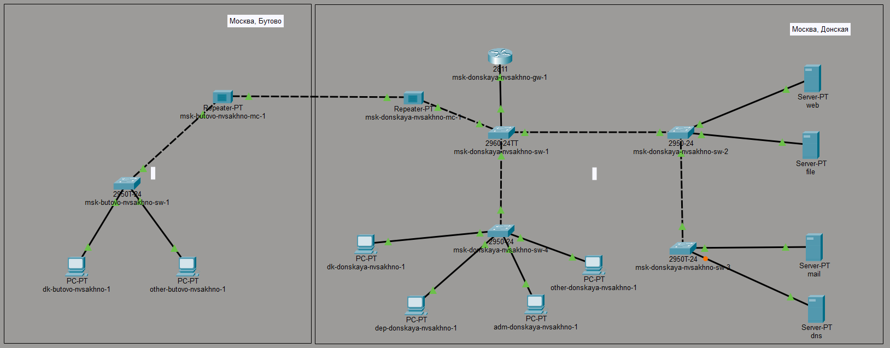{#fig-001 width=70%}

Активируем порты. (рис. [-@fig:002]).

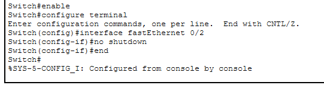{#fig-002 width=70%}

В конфигурации сервера укажем в качестве адреса шлюза 10.128.0.1, а в качестве адреса самого сервера — 10.128.0.5 с соответствующей маской 255.255.255.0 (рис. [-@fig:003]).

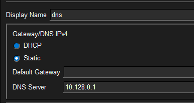{#fig-003 width=70%}

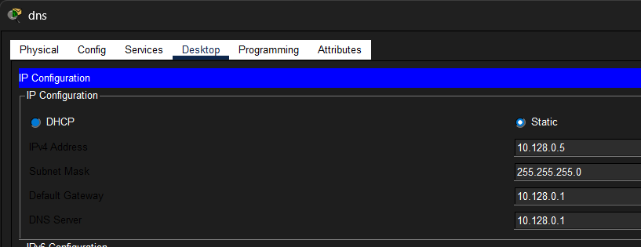{#fig-004 width=70%}

Настроим сервис DNS (рис. [-@fig:005]).

- в конфигурации сервера выберем службу DNS, активируем её (выбрав флаг On);
- в поле Type в качестве типа записи DNS выберем записи типа A (A Record);
- в поле Name укажем доменное имя, по которому можно обратиться, например, к web-серверу — www.donskaya.rudn.ru, затем укажем его IP-адрес в соответствующем поле 10.128.0.2;
- нажав на кнопку Add, добавим DNS-запись на сервер;
- аналогичным образом добавим DNS-записи для серверов mail, file, dns согласно распределению адресов из таблицы, сделанной в лабораторной работе №3;
- сохраним конфигурацию сервера.

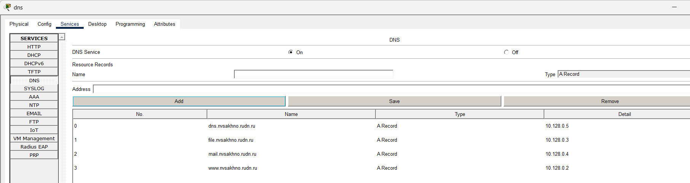{#fig-005 width=70%}

Настроим DHCP-сервис на маршрутизаторе, используя приведённые в лабораторной работе №8 команды для каждой выделенной сети (рис. [-@fig:006]).

- укажем IP-адрес DNS-сервера;
- перейдём к настройке DHCP;
- зададим название конфигурируемому диапазону адресов (пулу адресов), укажем адрес сети, а также адреса шлюза и DNS-сервера;
- зададим пулы адресов, исключаемых из динамического распределения.

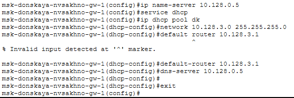{#fig-006 width=70%}

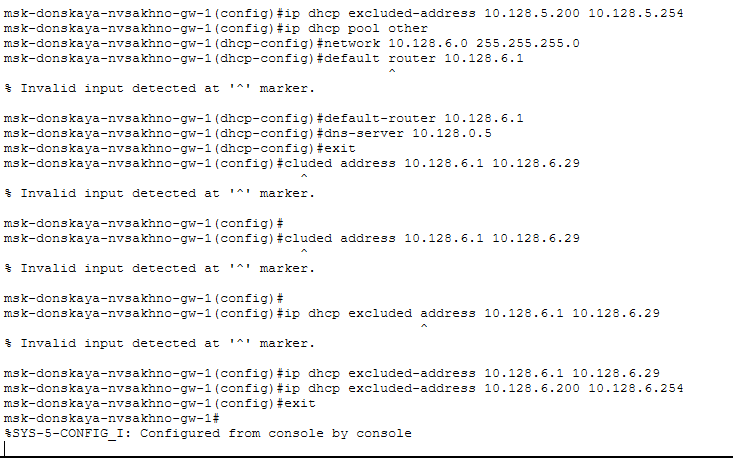{#fig-007 width=70%}

Посмотрим информацию о настроенных пулах DHCP (рис. [-@fig:008]).

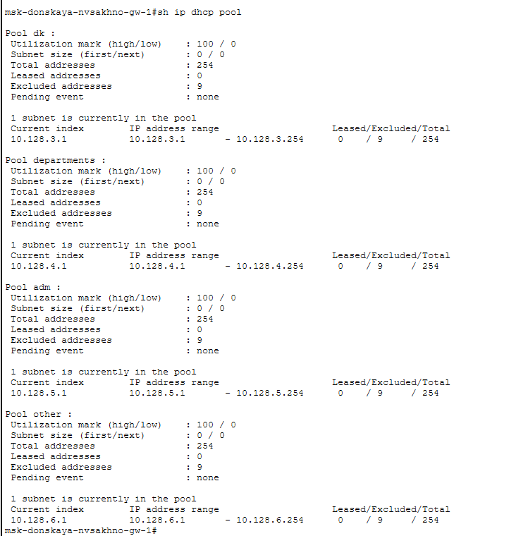{#fig-008 width=70%}

Также посмотрим информацию о привязках выданных адресов, но пока нет выданных адресов (рис. [-@fig:009]).

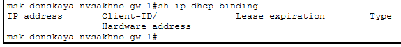{#fig-009 width=70%}

Изначально у нас были заданы статические IP-адреса, можем посмотреть их с помощью команды ipconfig (рис. [-@fig:010]).

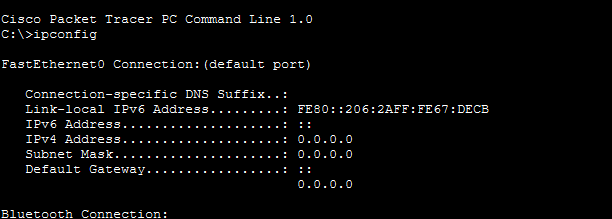{#fig-010 width=70%}

Теперь на оконечных устройствах заменим в настройках статическое распределение адресов на динамическое (рис. [-@fig:011]).

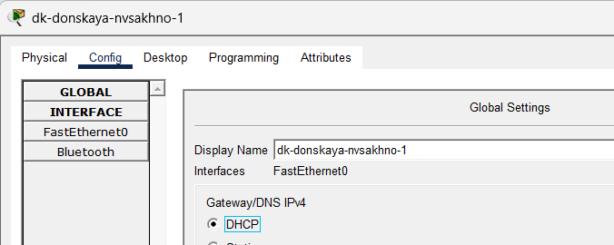{#fig-011 width=70%}

Проверим, какой IP-адрес выделен теперь (рис. [-@fig:012]).

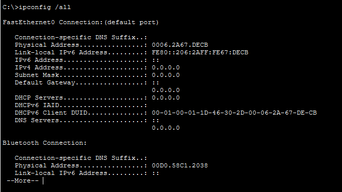{#fig-012 width=70%}

В режиме симуляции изучим, каким образом происходит запрос адреса по протоколу DHCP (рис. [-@fig:013]).

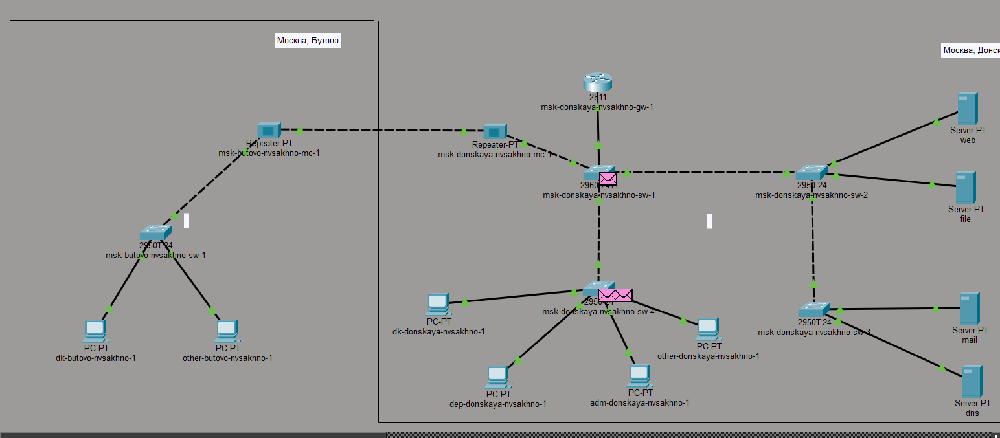{#fig-013 width=70%}

# Результаты

В результате выполнения лабораторной работы был добавлен и настроен DNS-сервер, для домена
`donskaya.rudn.ru` созданы DNS-записи типа A. На маршрутизаторе был настроен DHCP-сервис
с необходимыми параметрами сетей, шлюза и DNS-сервера.

Оконечные устройства были переведены со статической IP-адресации на динамическую.
После этого была выполнена проверка выделенных IP-адресов. В режиме симуляции был изучен
процесс запроса адреса по протоколу DHCP.

# Обсуждение результатов

Выполненная настройка позволила автоматизировать распределение IP-адресов между оконечными
устройствами. DNS-записи обеспечили возможность обращения к сетевым ресурсам по доменным
именам, а DHCP избавил от необходимости вручную задавать IP-параметры каждому клиенту.

Проверка параметров до и после перехода на DHCP, а также исследование обмена сообщениями
в режиме симуляции подтвердили выполнение основных этапов работы.

# Заключение

В ходе выполнения лабораторной работы я приобрел практические навыки по настройке
динамического распределения IP-адресов посредством протокола DHCP в локальной сети.
Также были настроены DNS-записи и рассмотрен процесс получения IP-адреса клиентским
устройством в режиме симуляции.

# Контрольные вопросы

1. За что отвечает протокол DHCP?

   Позволяет серверу динамически распределять IP-адреса и сведения о конфигурации клиентам.

2. Какие типы DHCP-сообщений передаются по сети?

   По данным источника, в DHCP-протоколе используются следующие типы сообщений:

   - DHCPDISCOVER — клиент отправляет пакет, пытаясь найти сервер DHCP в сети.
   - DHCPOFFER — сервер отправляет пакет, включающий предложение использовать уникальный IP-адрес.
   - DHCPREQUEST — клиент отправляет пакет с просьбой выдать в аренду предложенный уникальный адрес.
   - DHCPACK — сервер отправляет пакет, в котором утверждается запрос клиента на использование IP-адреса.

3. Какие параметры могут быть переданы в сообщениях DHCP?

   Параметры DHCP могут включать IP-адреса, шлюзы, DNS-серверы, временные интервалы аренды и другие настройки сети.

4. Что такое DNS?

   DNS (Система доменных имён, англ. Domain Name System) — это иерархическая децентрализованная система именования для интернет-ресурсов, подключённых к Интернет, которая ведёт список доменных имён вместе с их числовыми IP-адресами или местонахождениями. DNS позволяет перевести простое запоминаемое имя хоста в IP-адрес.

5. Какие типы записи описания ресурсов есть в DNS и для чего они используются?

   Основными ресурсными записями DNS являются:

   - A-запись — одна из самых важных записей. Именно эта запись указывает на IP-адрес сервера, который привязан к доменному имени.
   - MX-запись — указывает на сервер, который будет использован при отсылке доменной электронной почты.
   - NS-запись — указывает на DNS-сервер домена.
   - CNAME-запись — позволяет одному из поддоменов дублировать DNS-записи своего родителя.

# Список литературы {.unnumbered}

:::
:::

\appendix

# Что выносится в приложения {.appendix}

В приложения могут быть вынесены дополнительные скриншоты конфигурации DNS и DHCP,
а также результаты проверки параметров сетевых устройств.
