---
## Author
author:
  name: Сахно Никита НФИбд-02-23
  degrees: DSc
  orcid: 0000-0002-0877-7063
  email: 1132230298
  affiliation:
    - name: Российский университет дружбы народов
      country: Российская Федерация
      postal-code: 117198
      city: Москва
      address: ул. Миклухо-Маклая, д. 6

## Title
title: "Отчёт по лабораторной работе №9"
subtitle: "Администрирование локальных сетей"
license: "CC BY"
abstract: |
  В данном отчёте представлены результаты выполнения лабораторной работы по изучению
  протокола STP и его модификаций в локальной сети.

  Рассмотрены создание резервных соединений, настройка балансировки нагрузки,
  режим Portfast, отказоустойчивость STP и Rapid PVST+, а также агрегирование
  интерфейсов в режиме EtherChannel.

  Сделаны выводы по результатам выполненной настройки.
keywords: [STP, Rapid PVST+, Portfast, EtherChannel, отказоустойчивость, Cisco Packet Tracer]
---

# Введение

## Актуальность

Отказоустойчивость локальной сети является важным условием стабильной работы сетевых
сервисов. Протоколы семейства STP позволяют предотвращать петли второго уровня и
организовывать резервные пути, а механизмы Rapid PVST+ и EtherChannel позволяют
сократить время восстановления и эффективно использовать несколько физических
соединений.

## Цель работы

Изучение возможностей протокола STP и его модификаций по обеспечению отказоустойчивости сети, агрегированию интерфейсов и перераспределению нагрузки между ними.

## Задачи

1. Сформировать резервное соединение между коммутаторами msk-donskaya-sw-1 и msk-donskaya-sw-3.
2. Настроить балансировку нагрузки между резервными соединениями.
3. Настроить режим Portfast на тех интерфейсах коммутаторов, к которым подключены серверы.
4. Изучить отказоустойчивость резервного соединения.
5. Сформировать и настроить агрегированное соединение интерфейсов Fa0/20 – Fa0/23 между коммутаторами msk-donskaya-sw-1 и msk-donskaya-sw-4.
6. При выполнении работы необходимо учитывать соглашение об именовании.

## Объект и предмет исследования

**Объект исследования** — локальная сеть, построенная на коммутаторах Cisco.

**Предмет исследования** — механизмы STP и его модификаций, резервирование соединений,
Portfast и агрегирование интерфейсов с использованием EtherChannel.

## Методы исследования

В работе использовались практическая настройка сетевого оборудования в Cisco Packet Tracer,
анализ состояния STP, проверка связности с помощью `ping`, исследование движения ICMP-пакетов
в режиме симуляции, моделирование отказа интерфейса и настройка агрегированных каналов.

## Схема выполнения работы

На рис. -@fig-flowchart представлена общая последовательность действий при выполнении работы.

```{mermaid}
flowchart TD
    A[Создание резервного соединения] --> B[Настройка Trunk]
    B --> C[Проверка STP и ICMP]
    C --> D[Настройка корневого коммутатора]
    D --> E[Настройка Portfast]
    E --> F[Проверка отказоустойчивости STP]
    F --> G[Переход на Rapid PVST+]
    G --> H[Проверка восстановления]
    H --> I[Создание EtherChannel]
    I --> J[Проверка агрегированного соединения]
```

::: {#fig-flowchart}
Общая схема выполнения лабораторной работы.
:::

# Теоретическая часть

Протокол STP (Spanning Tree Protocol) предназначен для предотвращения петель в
коммутируемых сетях. При наличии резервных физических соединений STP определяет
активный путь и переводит избыточные интерфейсы в состояние, при котором они не
участвуют в передаче кадров. При отказе активного соединения резервный путь может
быть активирован.

Rapid PVST+ является модификацией STP, предназначенной для ускорения перестроения
топологии после изменения состояния сети. В работе также используется Portfast,
который применяется на интерфейсах, подключённых к оконечным устройствам.

EtherChannel позволяет объединить несколько физических интерфейсов в один логический
канал. Такое агрегирование повышает пропускную способность соединения и позволяет
распределять нагрузку между физическими интерфейсами.

# Материалы и методы

Для выполнения работы использовался проект Cisco Packet Tracer с ранее созданной
локальной сетью. В процессе работы применялись коммутаторы Cisco и оконечные устройства.

Основные этапы включали настройку резервных соединений, Trunk-портов, STP и Rapid PVST+,
режима Portfast, проверку восстановления после отказа соединения и настройку EtherChannel
между коммутаторами.

# Выполнение лабораторной работы

Сформировал резервное соединение между коммутаторами msk-donskaya-sw-1 и msk-donskaya-sw-3. Для этого:
- заменил соединение между коммутаторами msk-donskaya-sw-1 (Gig0/2) и msk-donskaya-sw-4 (Gig0/1) на соединение между коммутаторами msk-donskaya-sw-1 (Gig0/2) и msk-donskaya-sw-3 (Gig0/2);
- сделал порт на интерфейсе Gig0/2 коммутатора msk-donskaya-sw-3 транковым:

```text
msk-donskaya-sw-3(config)#int g0/2
msk-donskaya-sw-3(config-if)#switchport mode trunk
```

- соединение между коммутаторами msk-donskaya-sw-1 и msk-donskaya-sw-4 сделал через интерфейсы Fa0/23, не забыв активировать их в транковом режиме.

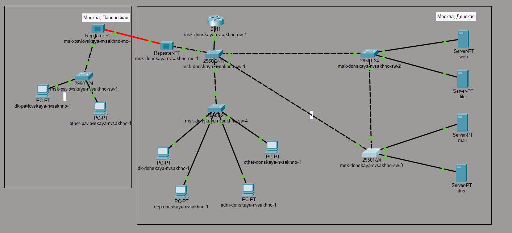{#fig-001 width=70%}

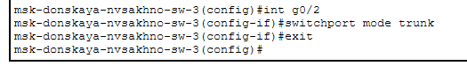{#fig-002 width=70%}

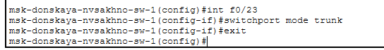{#fig-003 width=70%}

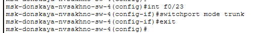{#fig-004 width=70%}

С оконечного устройства dk-donskaya-1 пропинговал серверы mail и web.

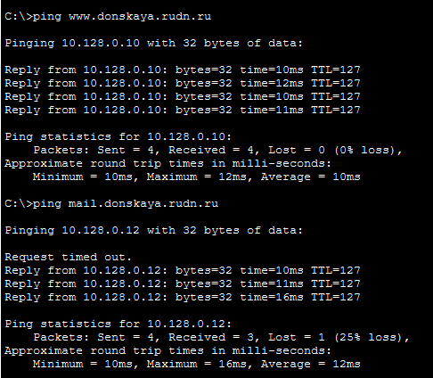{#fig-005 width=70%}

В режиме симуляции проследил движение пакетов ICMP. Убедился, что движение пакетов происходит через коммутатор msk-donskaya-sw-2.

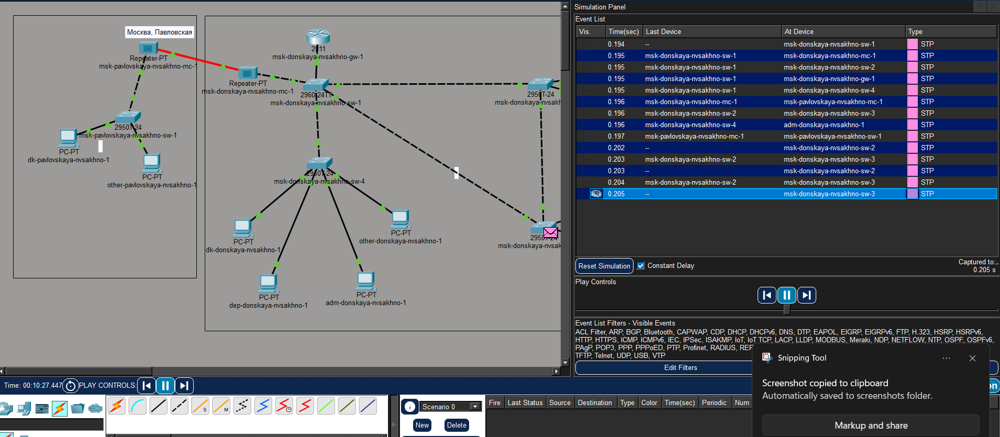{#fig-006 width=70%}

На коммутаторе msk-donskaya-sw-2 посмотрел состояние протокола STP для VLAN 3.

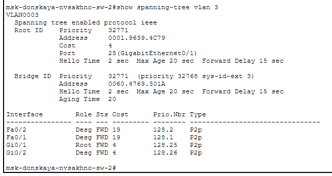{#fig-007 width=70%}

В качестве корневого коммутатора STP настроил коммутатор msk-donskaya-sw-1.

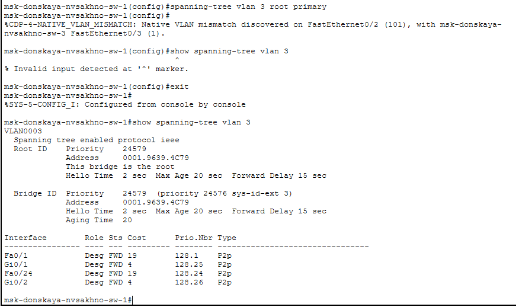{#fig-008 width=70%}

Используя режим симуляции, убедился, что пакеты ICMP пойдут от хоста dk-donskaya-1 до mail через коммутаторы msk-donskaya-sw-1 и msk-donskaya-sw-3, а от хоста dk-donskaya-1 до web через коммутаторы msk-donskaya-sw-1 и msk-donskaya-sw-2.

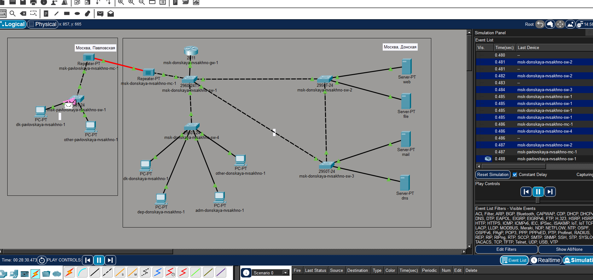{#fig-009 width=70%}

Настроил режим Portfast на тех интерфейсах коммутаторов, к которым подключены серверы.

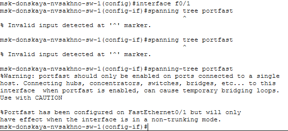{#fig-010 width=70%}

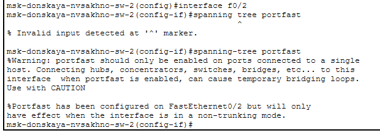{#fig-011 width=70%}

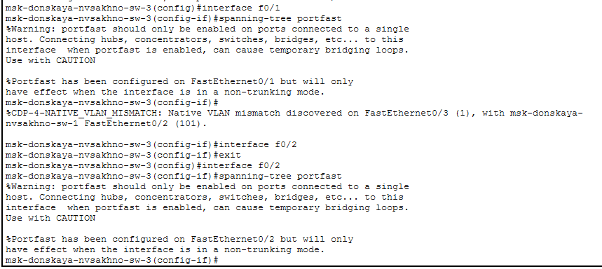{#fig-012 width=70%}

Изучил отказоустойчивость протокола STP и время восстановления соединения при переключении на резервное соединение. Для этого использовал команду `ping -n 1000 mail.donskaya.rudn.ru` на хосте dk-donskaya-1, а разрыв соединения обеспечил переводом соответствующего интерфейса коммутатора в состояние `shutdown`.

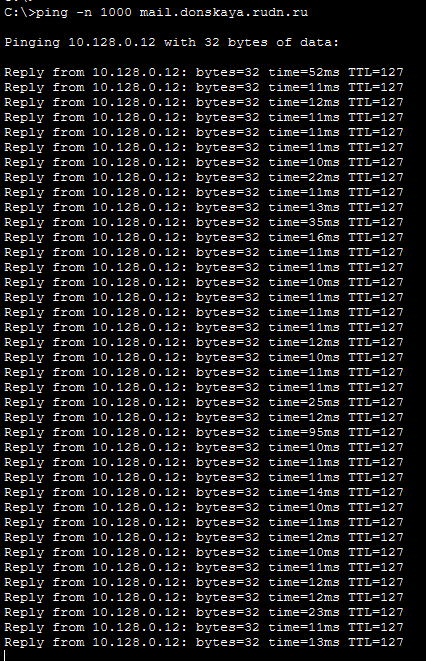{#fig-013 width=70%}

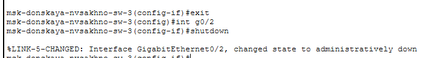{#fig-014 width=70%}

Переключил коммутаторы в режим работы по протоколу Rapid PVST+.

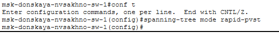{#fig-015 width=70%}

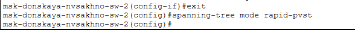{#fig-016 width=70%}

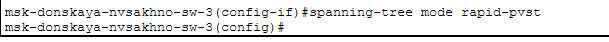{#fig-017 width=70%}

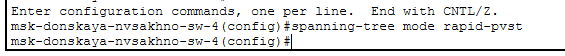{#fig-018 width=70%}

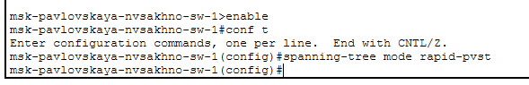{#fig-019 width=70%}

Изучил отказоустойчивость протокола Rapid PVST+ и время восстановления соединения при переключении на резервное соединение.

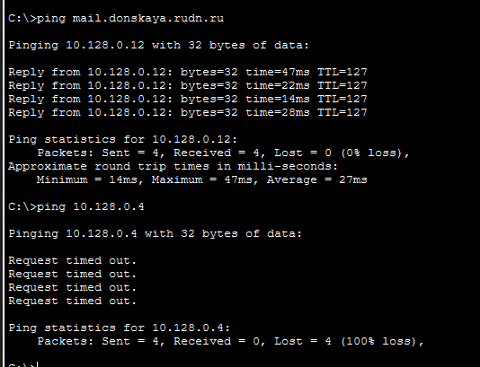{#fig-020 width=70%}

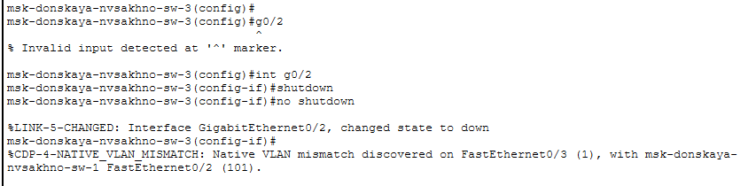{#fig-021 width=70%}

Сразу после разрыва задержки по времени не было, сеть перестроилась.

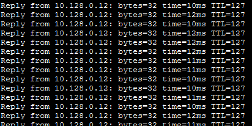{#fig-022 width=70%}

Сформировал агрегированное соединение интерфейсов Fa0/20 – Fa0/23 между коммутаторами msk-donskaya-sw-1 и msk-donskaya-sw-4.

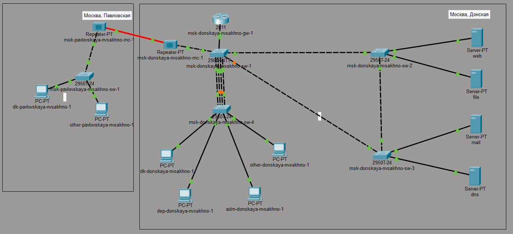{#fig-023 width=70%}

Настроил агрегирование каналов (режим EtherChannel).

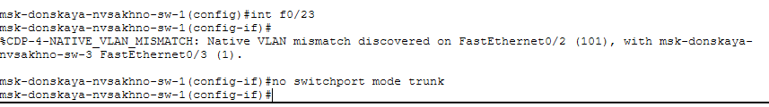{#fig-024 width=70%}

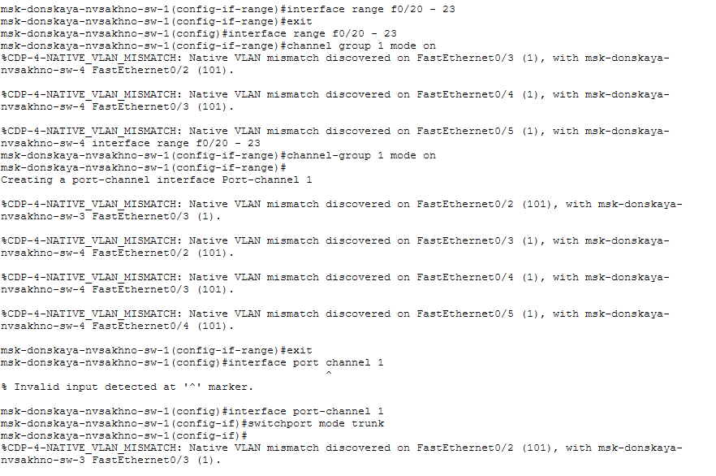{#fig-025 width=70%}

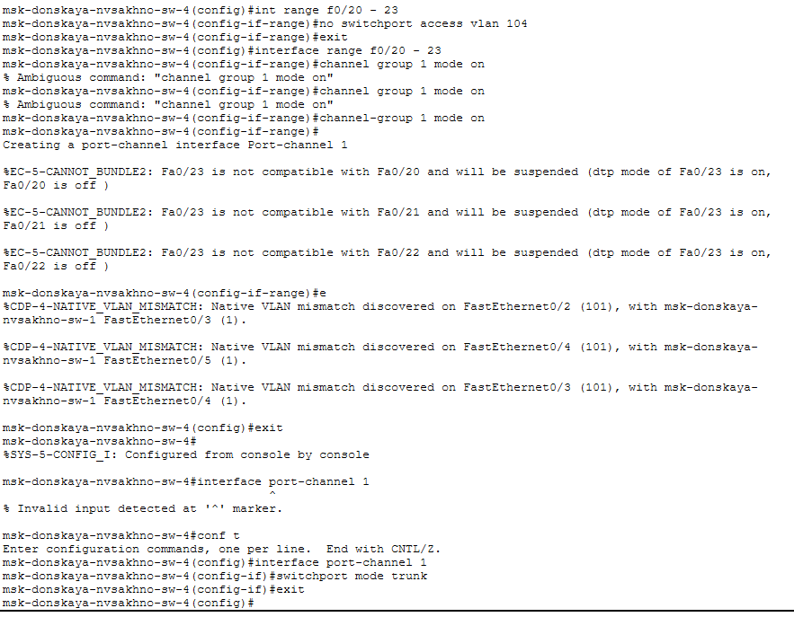{#fig-026 width=70%}

# Результаты

В результате работы было сформировано резервное соединение между коммутаторами,
настроены Trunk-порты и проверено прохождение ICMP-пакетов по выбранным STP путям.
Коммутатор msk-donskaya-sw-1 был настроен в качестве корневого.

На интерфейсах, к которым подключены серверы, был настроен режим Portfast. Затем была
проверена отказоустойчивость STP путём отключения соответствующего интерфейса и
наблюдения за переключением на резервное соединение.

После перехода на Rapid PVST+ была повторно исследована отказоустойчивость сети.
Также было сформировано агрегированное соединение Fa0/20–Fa0/23 между коммутаторами
msk-donskaya-sw-1 и msk-donskaya-sw-4 с использованием EtherChannel.

# Обсуждение результатов

Проведённые эксперименты показали назначение резервных соединений и механизмов STP:
при наличии нескольких путей протокол предотвращает образование сетевой петли и
обеспечивает возможность переключения трафика на резервный путь после отказа.

Использование Rapid PVST+ позволило исследовать более быстрое перестроение топологии.
Агрегирование интерфейсов в EtherChannel объединило несколько физических соединений
в один логический канал и создало условия для распределения нагрузки между ними.

# Заключение

В ходе выполнения работы я изучил возможности протокола STP и его модификаций по обеспечению отказоустойчивости сети, агрегированию интерфейсов и перераспределению нагрузки между ними.

# Список литературы {.unnumbered}

В работе использовались материалы методических указаний к лабораторной работе и документация по настройке STP, Rapid PVST+, Portfast и EtherChannel в Cisco Packet Tracer.

\appendix

# Что выносится в приложения {.appendix}

В приложения могут быть вынесены дополнительные скриншоты конфигурации STP,
Rapid PVST+, Portfast и EtherChannel, а также дополнительные результаты проверки
отказоустойчивости сети.
